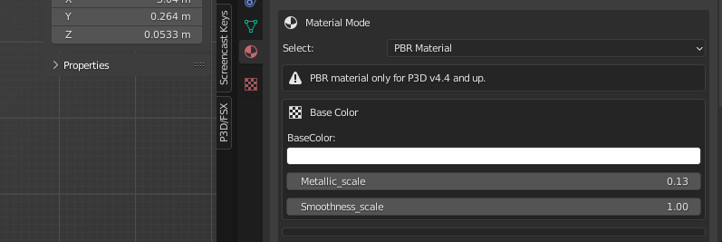
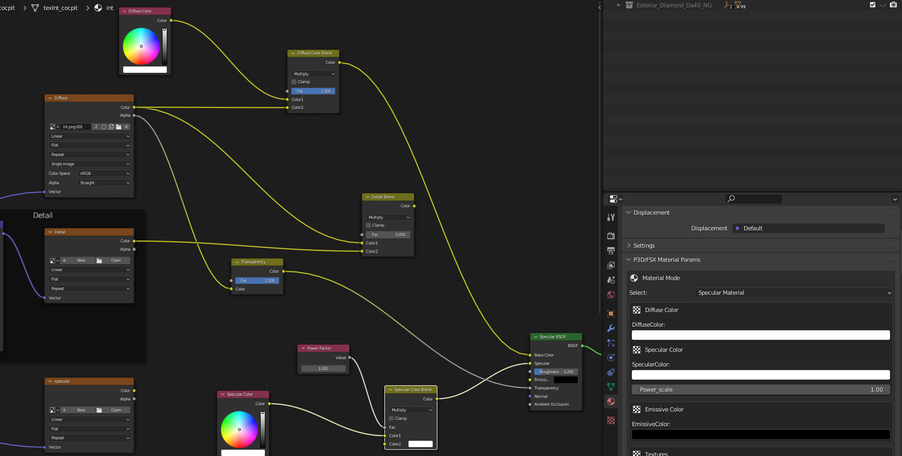

# Blender2P3DFSX
Blender 3.3 to FSX and P3D v 1.0.35

Highly experimental update to Add 

Base Color Albedo - PBR
Metallic factor and smoothness factor (1-Roughness)
Emissive Color

Diffuse Color
Specular Color
Power
Emissive Color

My own personal update to Blender2P3DFSX - Makes it work more like the MSFS 2020 exporter
Has the above colors as separate inputs along with the PBR Metallic and Smoothness, And Specular power
Emissive color also.

NOTE - Shader node behave like the MSFS exporter - do not modify anything directly in the shader workspace or on the Surface panel.
All things are updated when you add/delete textures.  Links are generated.

PBR

Specular

